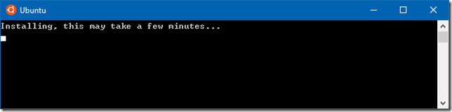
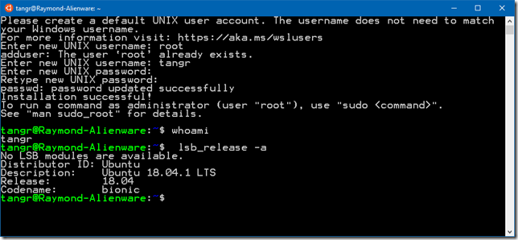
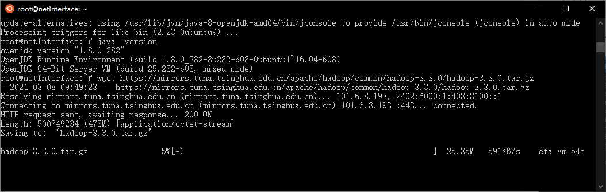
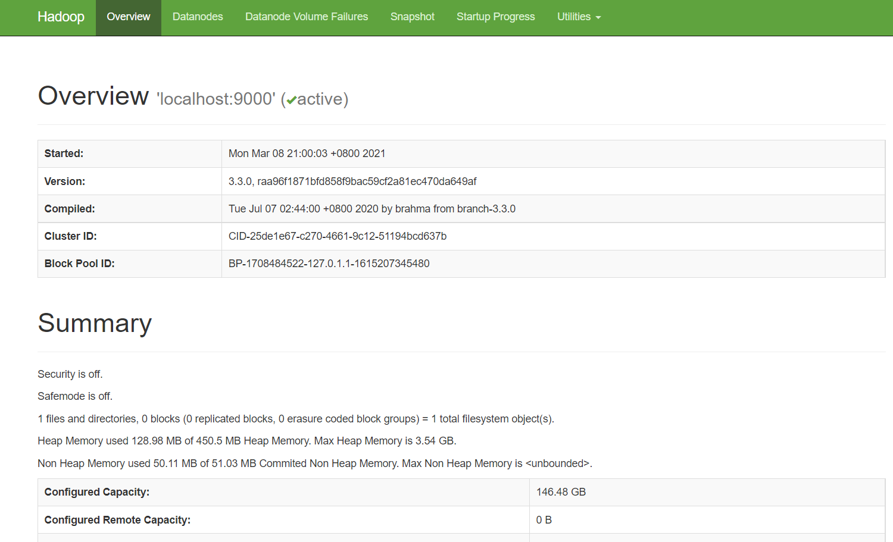
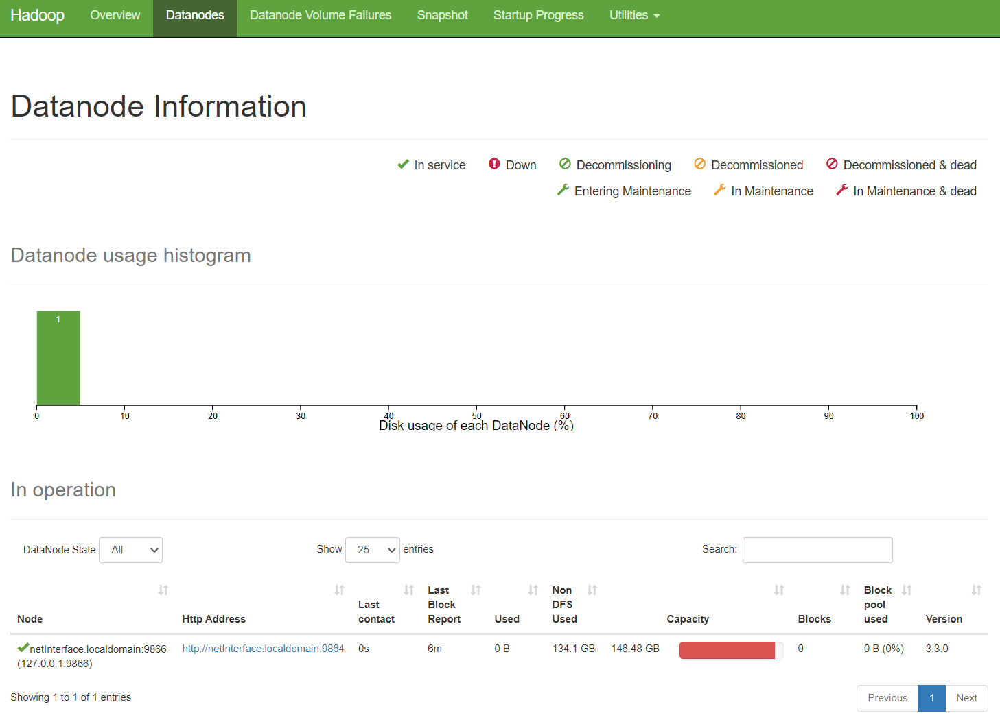
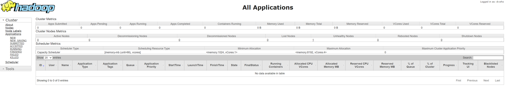

# Install Hadoop

[ÔĶÁÖÐÎÄ°æ±¾](installHadoop_cn.md)

<https://kontext.tech/column/hadoop/445/install-hadoop-330-on-windows-10-using-wsl>


***********************************

Hadoop 3.3.0 was released on July 14 2020. It is the first release of Apache 
Hadoop 3.3 line. There are significant changes compared with Hadoop 3.2.0, 
such as Java 11 runtime support, protobuf upgrade to 3.7.1, scheduling of 
opportunistic containers, non-volatile SCM support in HDFS cache directives, etc. 

This article provides step-by-step guidance to install Hadoop 3.3.0 on Windows 10 
via WSL (Windows Subsystem for Linux). These instructions are also be applied to 
Linux systems to install Hadoop.  

## Prerequisites

Follow the page below to enable WSL and then install one of the Linux systems 
from Microsoft Store.

[Windows Subsystem for Linux Installation Guide for Windows 10](https://docs.microsoft.com/en-us/windows/wsl/install-win10)

To be specific, enable WSL by running the following PowerShell code as 
Administrator (or enable it through Control Panel):
```shell
Enable-WindowsOptionalFeature -Online -FeatureName Microsoft-Windows-Subsystem-Linux
```
And then install Ubuntu from Microsoft Store.


Once download is completed, click Launch button to lunch the application. 
It make take a few minutes to install:



During the installation, you need to input a username and password. Once it 
is done, you are ready to use the Ubuntu terminal:



## Install Java JDK
Run the following command to update package index:
```shell
sudo apt update
```

Check whether Java is installed already:
```shell
java -version
```

Command 'java' not found, but can be installed with:
```shell
sudo apt install default-jre
sudo apt install openjdk-11-jre-headless
sudo apt install openjdk-8-jre-headless
```

Install OpenJDK via the following command:
```shell
sudo apt-get install openjdk-8-jdk
```

Check the version installed:
```shell
java -version
openjdk version "1.8.0_191"
OpenJDK Runtime Environment (build 1.8.0_191-8u191-b12-2ubuntu0.18.04.1-b12)
OpenJDK 64-Bit Server VM (build 25.191-b12, mixed mode)
```

You can also use Java 11 from this version as it is now supported.

## Download Hadoop binary
Go to release page of Hadoop website to find a download URL for Hadoop 3.3.0:

[Hadoop Releases](https://hadoop.apache.org/releases.html)

For me, the closest mirror is:

<https://mirrors.tuna.tsinghua.edu.cn/apache/hadoop/common/hadoop-3.3.0/hadoop-3.3.0.tar.gz>

Run the following command in Ubuntu terminal to download a binary from the internet:
```shell
wget https://mirrors.tuna.tsinghua.edu.cn/apache/hadoop/common/hadoop-3.3.0/hadoop-3.3.0.tar.gz

# wget https://mirrors.bfsu.edu.cn/apache/hadoop/common/hadoop-3.3.0/hadoop-3.3.0.tar.gz
```
Wait until the download is completed:



## Unzip Hadoop binary
Run the following command to create a hadoop folder under user home folder:
```shell
mkdir ~/hadoop
```
And then run the following command to unzip the binary package:
```cpp
tar -xvzf hadoop-3.3.0.tar.gz -C ~/hadoop/
```
Once it is unpacked, change the current directory to the Hadoop folder:
```cpp
cd ~/hadoop/hadoop-3.3.0/
```

## Configure passphraseless ssh
**This step is critical and please make sure you follow the steps.**

Make sure you can SSH to localhost in Ubuntu:
```cpp
ssh localhost
```
If you cannot ssh to localhost without a passphrase, run the following command 
to initialize your private and public keys:
```cpp
ssh-keygen -t rsa -P '' -f ~/.ssh/id_rsa
cat ~/.ssh/id_rsa.pub >> ~/.ssh/authorized_keys
chmod 0600 ~/.ssh/authorized_keys
```
If you encounter errors like ¡®ssh: connect to host localhost port 22: 
Connection refused¡¯, run the following commands:
```cpp
sudo apt-get install ssh
```
And then restart the service:
```cpp
sudo service ssh restart
```

## Configure the pseudo-distributed mode (Single-node mode)
Now, we can follow the official guide to configure a single node:

[Pseudo-Distributed Operation](https://hadoop.apache.org/docs/r3.3.0/hadoop-project-dist/hadoop-common/SingleCluster.html#Pseudo-Distributed_OperationPseudo-Distributed_Operation)

1) Setup environment variables (optional)

Setup environment variables by editing file **~/.bashrc**.
```cpp
vi ~/.bashrc
```
Add the following environment variables:
```cpp
export JAVA_HOME=/usr/lib/jvm/java-1.8.0-openjdk-amd64
export HADOOP_HOME=~/hadoop/hadoop-3.3.0
export PATH=$PATH:$HADOOP_HOME/bin
export HADOOP_CONF_DIR=$HADOOP_HOME/etc/hadoop
```
Run the following command to source the latest variables:
```cpp
source ~/.bashrc
```
2) Edit **etc/hadoop/hadoop-env.sh** file:
```cpp
vi etc/hadoop/hadoop-env.sh
```
Set a JAVA_HOME environment variable:
```cpp
export JAVA_HOME=/usr/lib/jvm/java-8-openjdk-amd64
```
3) Edit **etc/hadoop/core-site.xml**:
```cpp
vi etc/hadoop/core-site.xml
```
Add the following configuration:
```xml
<configuration>
     <property>
         <name>fs.defaultFS</name>
         <value>hdfs://localhost:9000</value>
     </property>
</configuration>
```
4) Edit **etc/hadoop/hdfs-site.xml**:
```cpp
vi etc/hadoop/hdfs-site.xml
```
Add the following configuration:
```xml
<configuration>
     <property>
         <name>dfs.replication</name>
         <value>1</value>
     </property>
</configuration>
```
5) Edit file **etc/hadoop/mapred-site.xml**:
```cpp
vi etc/hadoop/mapred-site.xml
```
Add the following configuration:
```xml
<configuration>
     <property>
         <name>mapreduce.framework.name</name>
         <value>yarn</value>
     </property>
     <property>
         <name>mapreduce.application.classpath</name>
         <value>$HADOOP_MAPRED_HOME/share/hadoop/mapreduce/*:$HADOOP_MAPRED_HOME/share/hadoop/mapreduce/lib/*</value>
     </property>
</configuration>
```
6) Edit file **etc/hadoop/yarn-site.xml**:
```cpp
vi etc/hadoop/yarn-site.xml
```
Add the following configuration:
```xml
<configuration>
    <property>
        <name>yarn.nodemanager.aux-services</name>
        <value>mapreduce_shuffle</value>
    </property>
    <property>
        <name>yarn.nodemanager.env-whitelist</name>
        <value>JAVA_HOME,HADOOP_COMMON_HOME,HADOOP_HDFS_HOME,HADOOP_CONF_DIR,CLASSPATH_PREPEND_DISTCACHE,HADOOP_YARN_HOME,HADOOP_MAPRED_HOME</value>
    </property>
</configuration>
```

7) Edit file **sbin/start-dfs.sh** and **sbin/stop-dfs.sh**:
```cpp
vi sbin/start-dfs.sh
```
and
```cpp
vi sbin/stop-dfs.sh
```
Add the following lines right below the first line:
```cpp
#!/usr/bin/env bash
HDFS_DATANODE_USER=root
HADOOP_SECURE_DN_USER=hdfs
HDFS_NAMENODE_USER=root
HDFS_SECONDARYNAMENODE_USER=root
```
Note that 
```cpp
#!/usr/bin/env bash
```
is the first line.


8) Edit file **start-yarn.sh** and **stop-yarn.sh**:
```cpp
vi sbin/start-yarn.sh
```
and
```cpp
vi sbin/stop-yarn.sh
```
Add the following lines right below the first line:
```cpp
#!/usr/bin/env bash
YARN_RESOURCEMANAGER_USER=root
HADOOP_SECURE_DN_USER=yarn
YARN_NODEMANAGER_USER=root
```
Note that 
```cpp
#!/usr/bin/env bash
```
is the first line.

## Format namenode
Run the following command to format the name node:
```cpp
bin/hdfs namenode -format
```
## Run DFS daemons
1) Run the following commands to start NameNode and DataNode daemons:
```cpp
tangr@raymond-pc:~/hadoop/hadoop-3.3.0$ sbin/start-dfs.sh
Starting namenodes on [localhost]
Starting datanodes
Starting secondary namenodes [raymond-pc]
```
2) Check status via **jps** command:
```cpp
tangr@raymond-pc:~/hadoop/hadoop-3.3.0$ jps
2212 NameNode
2423 DataNode
2682 SecondaryNameNode
2829 Jps
```
When the services are initiated successfully, you should be able to see these four processes.

3) View name node portal

You can view the name node through the following URL:

http://localhost:9870/dfshealth.html#tab-overview

The web UI looks like the following:



You can also view the data nodes information through menu link Datanodes:



## Run YARN daemon
1) Run the following command to start YARN daemon:
```cpp
sbin/start-yarn.sh
```

```cpp
~/hadoop/hadoop-3.3.0$ sbin/start-yarn.sh
WARNING: YARN_CONF_DIR has been replaced by HADOOP_CONF_DIR. Using value of YARN_CONF_DIR.
Starting resourcemanager
WARNING: YARN_CONF_DIR has been replaced by HADOOP_CONF_DIR. Using value of YARN_CONF_DIR.
Starting nodemanagers
WARNING: YARN_CONF_DIR has been replaced by HADOOP_CONF_DIR. Using value of YARN_CONF_DIR.
```
2) Check status via jps command
```cpp
tangr@raymond-pc:~/hadoop/hadoop-3.3.0$ jps
2212 NameNode
5189 NodeManager
2423 DataNode
5560 Jps
5001 ResourceManager
2682 SecondaryNameNode
```
Once the services are started, you can see two more processes for NodeManager and ResourceManager.

3) View YARN web portal

You can view the YARN resource manager web UI through the following URL:

http://localhost:8088/cluster

The web UI looks like the following:



You can view all the applications through this web portal. 

## Shutdown services
Once you've completed explorations, you can use the following command to shutdown those daemons:
```cpp
sbin/stop-yarn.sh
sbin/stop-dfs.sh
```
You can verify through jps command which will only show one process now:
```cpp
tangr@raymond-pc:~/hadoop/hadoop-3.3.0$ jps
6593 Jps
```

## Summary
Congratulations! Now you have successfully installed a single node Hadoop 3.3.0 cluster in your Ubuntu subsystem of Windows 10. It¡¯s relatively easier compared with native Windows installation as we don¡¯t need to download or build native Hadoop HDFS libraries.

Have fun with Hadoop 3.3.0.

If you encounter any issues, please post a comment and I will try my best to help. 
