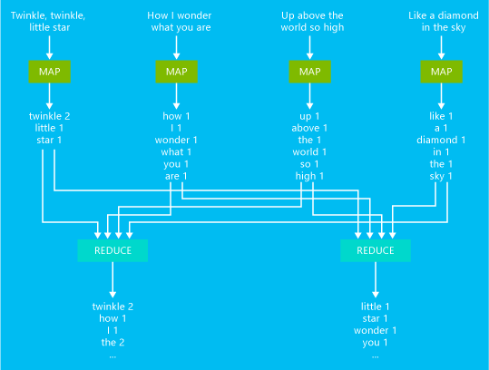

# 大数据 ―― 分析与处理

[Go to English Version](tools.md)

<https://www.softwaretestinghelp.com/big-data-tools/>

***********************************

众所周知，数据不仅是当今 IT 世界的一切，而且数据每天都在激增。
早期我们谈论数据的单位还是千字节和兆字节，但时至今日早已是TB级别。

如果无法变成有用的信息和知识来进行管理决策，数据将毫无意义的。
为此，我们需要分析软件的帮助来处理大数据。这种软件有助于存储、
分析、报告和处理海量的大数据。

## 1. Apache Hadoop

Apache Hadoop 是用于聚集文件系统及大数据处理的软件框架。
其采用 MapReduce 编程模型来处理大数据的数据集。

Apache Hadoop 是原始的开源框架，适用于对群集上的大数据集进行分布式处理和分析。 
Hadoop 生态系统包括相关的软件和实用程序，例如 Apache Hive、Apache HBase、Spark、
Kafka 等等。

Hadoop 以 Java 书写并支持跨平台。该软件在 Apache 许可条款下免费使用。
毫无疑问，它是当下最流行的大数据工具，超过一半的财富50强公司使用 Hadoop，
包括一些大牌公司例如亚马逊网络服务、Hortonworks、IBM、英特尔、微软及Facebook等等。

特点:

* Hadoop 的核心优势在于其 HDFS（Hadoop Distributed File System），
该系统能够在同一文件系统上保存所有类型的数据 ―― 视频、图像、JSON、XML 和纯文本。
* 对研发非常有用。
* 提供对数据的快速访问。
* 高可扩展性。
* 部署在集群商的高可用服务。

局限:

* 磁盘空间有时会因其 3 倍的数据冗余而出现问题。
* I/O 操作需要进行优化以获得更好的性能。

## 2. 什么是 MapReduce ？

Apache Hadoop MapReduce 是一个软件框架，用于编写处理海量数据的作业。 
输入的数据将拆分为独立的区块。 每个区块跨群集中的节点并行进行处理。 
MapReduce 作业包括两个函数：
* 映射器：使用输入数据，对数据进行分析（通常使用筛选器和排序操作），并发出元组（键/值对）
* 化简器：使用映射器发出的元组并执行汇总运算，以基于映射器数据创建更小的合并结果

下图演示了一个基本的单词计数 MapReduce 作业示例：

此作业的输出是文本中每个单词出现次数的计数。
* 映射器将输入文本中的每行用作一个输入并将其拆分为多个单词。 
每当文本中的单词后跟一个 1 时，映射器将发出一个键/值对。 输出在发送到化简器之前经过排序。
* 随后，化简器会计算每个单词的计数的和并发出一个键/值对（包含单词，
后跟该单词的总出现次数）。

MapReduce 可使用多种语言实现。 Java 是最常见的实现，本课程中使用该语言进行演示。